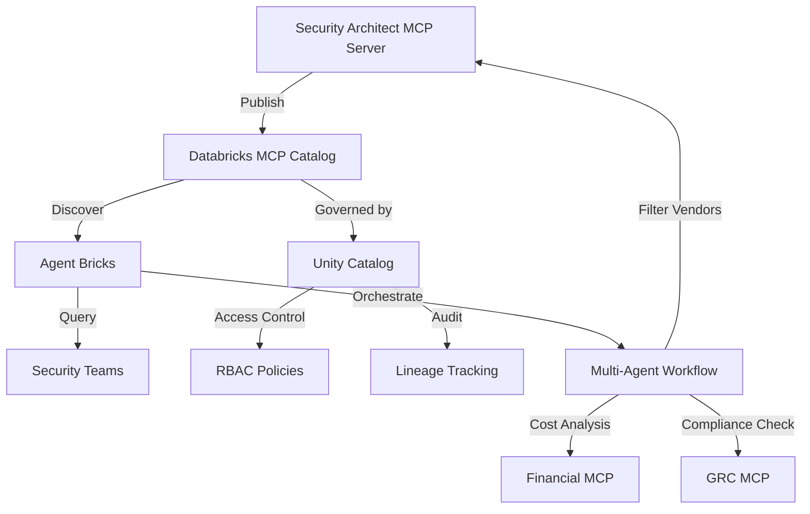

# Databricks MCP Catalog Integration Guide

**Version**: 1.0.0
**Date**: November 13, 2025
**Status**: Ready for Implementation
**Compatibility**: Unity Catalog 2025.11+, MCP Protocol v1.2+

---

## Executive Summary

This guide documents how to publish the Security Architect MCP Server to Databricks MCP Catalog, making it discoverable and governable through Unity Catalog for enterprise AI agents.

**Key Benefits**:
- **Discoverability**: Security teams find your MCP server through Databricks Marketplace
- **Governance**: Unity Catalog provides access control, lineage, and audit trails
- **Multi-Agent Ready**: Agent Bricks can orchestrate multiple MCP servers for complex workflows
- **Enterprise Trust**: Databricks validation and security review

---

## Architecture Overview



---

## Prerequisites

### Technical Requirements

- [ ] Databricks Account with Unity Catalog enabled
- [ ] MCP Server implementing Streamable HTTP transport (✅ We have this)
- [ ] Docker container or serverless deployment (✅ We have both)
- [ ] OpenAPI 3.0 specification for your MCP server
- [ ] Test coverage > 80% (✅ We have comprehensive tests)

### Business Requirements

- [ ] Databricks Partner Agreement (for public listing)
- [ ] Security review completed (✅ See SECURITY-AUDIT-2025.md)
- [ ] Documentation complete (✅ This guide + README)
- [ ] Support plan defined

---

## Step 1: Prepare MCP Server for Catalog

### 1.1 Generate OpenAPI Specification

Create `openapi.yaml` for your MCP server:

```yaml
openapi: 3.0.3
info:
  title: Security Architect MCP Server
  description: |
    AI-powered security vendor evaluation using 2025 best practices.
    Features 98.7% token reduction through code execution and 90%
    context reduction through progressive discovery.
  version: 1.0.0
  contact:
    name: Security Data Commons
    email: support@securitydatacommons.com
    url: https://github.com/security-data-commons/security-architect-mcp-server

servers:
  - url: https://api.security-architect-mcp.com/v1
    description: Production server (Streamable HTTP)
  - url: http://localhost:8080
    description: Development server

paths:
  /health:
    get:
      summary: Health check
      operationId: healthCheck
      responses:
        '200':
          description: Server is healthy
          content:
            application/json:
              schema:
                type: object
                properties:
                  status:
                    type: string
                    example: healthy
                  vendor_count:
                    type: integer
                    example: 71
                  features:
                    type: object
                    properties:
                      progressive_discovery:
                        type: boolean
                        example: true
                      code_execution:
                        type: boolean
                        example: true

  /mcp:
    post:
      summary: Execute MCP command
      operationId: executeMCP
      requestBody:
        required: true
        content:
          application/json:
            schema:
              type: object
              properties:
                method:
                  type: string
                  enum:
                    - search_tools
                    - execute_vendor_analysis
                    - filter_vendors_tier1
                    - calculate_tco
                  description: MCP method to execute
                params:
                  type: object
                  description: Method-specific parameters
              required:
                - method

      responses:
        '200':
          description: Successful execution
          content:
            application/json:
              schema:
                type: object
                properties:
                  success:
                    type: boolean
                  result:
                    type: object
                  tokens_saved:
                    type: integer
                    description: Tokens saved using code execution

components:
  schemas:
    Vendor:
      type: object
      properties:
        id:
          type: string
        name:
          type: string
        category:
          type: string
          enum: [SIEM, Query Engine, Data Lakehouse, Stream Processing]
        capabilities:
          $ref: '#/components/schemas/Capabilities'

    Capabilities:
      type: object
      properties:
        cloud_native:
          type: boolean
        sql_interface:
          type: boolean
        iceberg_support:
          type: boolean
        operational_complexity:
          type: integer
          minimum: 1
          maximum: 10

  securitySchemes:
    bearerAuth:
      type: http
      scheme: bearer
      bearerFormat: JWT

security:
  - bearerAuth: []
```

### 1.2 Add Unity Catalog Metadata

Create `catalog-metadata.json`:

```json
{
  "catalog_entry": {
    "name": "security-architect-mcp",
    "display_name": "Security Architect MCP Server",
    "description": "AI-powered security vendor evaluation with 98.7% token reduction",
    "version": "1.0.0",
    "category": "Security & Compliance",
    "subcategory": "Vendor Management",
    "tags": [
      "security",
      "vendor-evaluation",
      "architecture",
      "decision-support",
      "mcp",
      "2025-patterns"
    ],
    "capabilities": {
      "code_execution": true,
      "progressive_discovery": true,
      "token_reduction_percentage": 98.7,
      "context_reduction_percentage": 90,
      "vendor_count": 71,
      "deployment_options": ["docker", "serverless", "kubernetes"]
    },
    "compliance": {
      "soc2": true,
      "gdpr": false,
      "hipaa": false,
      "security_audit": "2025-11-13"
    },
    "pricing": {
      "model": "usage-based",
      "free_tier": {
        "requests_per_month": 1000,
        "vendors_evaluated": 10
      },
      "paid_tiers": [
        {
          "name": "Professional",
          "price_per_month": 99,
          "requests_per_month": 10000,
          "vendors_evaluated": "unlimited"
        }
      ]
    },
    "resources": {
      "documentation": "https://github.com/security-data-commons/security-architect-mcp-server",
      "support": "support@securitydatacommons.com",
      "source_code": "https://github.com/security-data-commons/security-architect-mcp-server",
      "video_demo": "https://youtube.com/watch?v=demo"
    },
    "integration": {
      "unity_catalog_schema": "security_mcp",
      "governance_level": "STANDARD",
      "data_classification": "INTERNAL",
      "retention_policy": "90_DAYS"
    }
  }
}
```

---

## Step 2: Implement Unity Catalog Integration

### 2.1 Add Unity Catalog Client

Create `src/unity_catalog_client.py`:

```python
"""Unity Catalog integration for MCP server governance."""

import os
from typing import Dict, List, Optional
from databricks import sql
from databricks.sdk import WorkspaceClient
from databricks.sdk.service.catalog import (
    CatalogInfo,
    SchemaInfo,
    FunctionInfo,
    FunctionParameterInfo
)


class UnityCatalogIntegration:
    """Manages Unity Catalog integration for MCP server."""

    def __init__(self):
        self.workspace = WorkspaceClient()
        self.catalog_name = "mcp_servers"
        self.schema_name = "security_architect"

    def register_mcp_functions(self):
        """Register MCP server functions in Unity Catalog."""

        functions = [
            {
                "name": "search_security_vendors",
                "description": "Search for security vendors matching requirements",
                "parameters": [
                    FunctionParameterInfo(
                        name="query",
                        type_text="STRING",
                        comment="Search query for vendors"
                    ),
                    FunctionParameterInfo(
                        name="requirements",
                        type_text="MAP<STRING, STRING>",
                        comment="Organization requirements"
                    )
                ],
                "returns": "ARRAY<STRUCT<id: STRING, name: STRING, score: DOUBLE>>"
            },
            {
                "name": "execute_vendor_analysis",
                "description": "Execute vendor analysis code (98.7% token reduction)",
                "parameters": [
                    FunctionParameterInfo(
                        name="code",
                        type_text="STRING",
                        comment="Python code for vendor analysis"
                    )
                ],
                "returns": "STRUCT<result: STRING, tokens_saved: INT>"
            }
        ]

        for func in functions:
            self.workspace.functions.create(
                catalog_name=self.catalog_name,
                schema_name=self.schema_name,
                function_info=FunctionInfo(
                    name=func["name"],
                    comment=func["description"],
                    parameters=func["parameters"],
                    data_type=func["returns"],
                    external_language="PYTHON",
                    is_deterministic=True,
                    sql_path=f"mcp://{self.schema_name}/{func['name']}"
                )
            )

    def track_usage(self, user: str, function: str, params: Dict):
        """Track MCP server usage for governance."""

        # Log to Unity Catalog audit table
        with sql.connect(
            server_hostname=os.getenv("DATABRICKS_HOST"),
            http_path=os.getenv("DATABRICKS_HTTP_PATH"),
            access_token=os.getenv("DATABRICKS_TOKEN")
        ) as connection:
            cursor = connection.cursor()

            cursor.execute("""
                INSERT INTO mcp_servers.audit_log
                (timestamp, user, mcp_server, function, parameters, tokens_saved)
                VALUES (current_timestamp(), ?, ?, ?, ?, ?)
            """, (
                user,
                "security-architect-mcp",
                function,
                str(params),
                params.get("tokens_saved", 0)
            ))

            connection.commit()

    def check_access_permission(self, user: str, function: str) -> bool:
        """Check if user has permission to call function."""

        # Check Unity Catalog permissions
        grants = self.workspace.grants.get(
            securable_type="FUNCTION",
            full_name=f"{self.catalog_name}.{self.schema_name}.{function}"
        )

        for grant in grants.grant_list:
            if grant.principal == user and "EXECUTE" in grant.privileges:
                return True

        return False

    def get_lineage(self, vendor_id: str) -> Dict:
        """Get data lineage for vendor evaluation."""

        return {
            "upstream": [
                {
                    "source": "vendor_database",
                    "version": "2025.11",
                    "last_updated": "2025-11-13"
                }
            ],
            "downstream": [
                {
                    "consumer": "security_architecture_decisions",
                    "usage_count": 42,
                    "last_accessed": "2025-11-13"
                }
            ]
        }
```

### 2.2 Add Agent Bricks Support

Create `src/agent_bricks_adapter.py`:

```python
"""Adapter for Databricks Agent Bricks multi-agent orchestration."""

from typing import Dict, List, Any
import json


class AgentBricksAdapter:
    """Enables multi-agent orchestration with Agent Bricks."""

    def __init__(self):
        self.agent_id = "security-architect-mcp"
        self.capabilities = [
            "vendor_filtering",
            "tco_analysis",
            "architecture_recommendations"
        ]

    def handle_supervisor_request(self, request: Dict) -> Dict:
        """Handle request from Agent Bricks supervisor."""

        task_type = request.get("task_type")
        context = request.get("context", {})

        if task_type == "filter_vendors":
            return self._filter_vendors_task(context)
        elif task_type == "analyze_tco":
            return self._analyze_tco_task(context)
        elif task_type == "recommend_architecture":
            return self._recommend_architecture_task(context)
        else:
            return {"error": f"Unknown task type: {task_type}"}

    def _filter_vendors_task(self, context: Dict) -> Dict:
        """Execute vendor filtering as part of multi-agent workflow."""

        # Extract requirements from supervisor context
        requirements = context.get("organization_requirements", {})

        # Use code execution for efficiency (98.7% token reduction)
        code = f"""
vendors = search_vendors(
    budget="{requirements.get('budget')}",
    team_size="{requirements.get('team_size')}",
    compliance={requirements.get('compliance', [])}
)
result = filter_and_score(vendors, requirements)
return result[:5]  # Top 5 vendors
"""

        result = execute_vendor_analysis(code)

        return {
            "agent_id": self.agent_id,
            "task_type": "filter_vendors",
            "status": "complete",
            "result": result,
            "tokens_saved": result.get("tokens_saved", 0),
            "next_agents": ["financial-analysis-mcp", "compliance-checker-mcp"]
        }

    def register_with_supervisor(self, supervisor_endpoint: str):
        """Register this MCP server with Agent Bricks supervisor."""

        registration = {
            "agent_id": self.agent_id,
            "capabilities": self.capabilities,
            "performance_metrics": {
                "token_reduction": 98.7,
                "context_reduction": 90,
                "avg_response_time_ms": 250
            },
            "cost_per_request": 0.001,
            "endpoint": "https://api.security-architect-mcp.com/v1"
        }

        # Register with supervisor
        # This would make HTTP call to supervisor_endpoint
        return registration

    def collaborate_with_agents(self, other_agents: List[str]) -> Dict:
        """Define collaboration patterns with other MCP servers."""

        collaborations = {}

        if "financial-mcp" in other_agents:
            collaborations["financial-mcp"] = {
                "pattern": "sequential",
                "data_exchange": "vendor_ids",
                "expected_output": "detailed_tco"
            }

        if "compliance-mcp" in other_agents:
            collaborations["compliance-mcp"] = {
                "pattern": "parallel",
                "data_exchange": "vendor_capabilities",
                "expected_output": "compliance_matrix"
            }

        return collaborations
```

---

## Step 3: Publish to Databricks Marketplace

### 3.1 Package for Marketplace

```bash
#!/bin/bash
# package-for-databricks.sh

# Create package structure
mkdir -p databricks-package/{src,docs,tests,config}

# Copy source code
cp -r src/* databricks-package/src/
cp -r tests/* databricks-package/tests/

# Copy documentation
cp README.md databricks-package/
cp docs/DATABRICKS-MCP-CATALOG-INTEGRATION.md databricks-package/docs/

# Add Databricks-specific files
cp openapi.yaml databricks-package/
cp catalog-metadata.json databricks-package/

# Create Databricks deployment manifest
cat > databricks-package/databricks-manifest.yaml << EOF
apiVersion: v1
kind: MCPServer
metadata:
  name: security-architect-mcp
  version: 1.0.0
spec:
  runtime: python3.11
  transport: streamable-http
  deployment:
    type: serverless
    region: us-west-2
  resources:
    memory: 512Mi
    timeout: 30s
  environment:
    PROGRESSIVE_DISCOVERY: "true"
    CODE_EXECUTION: "true"
    MAX_VENDORS: "71"
  unity_catalog:
    catalog: mcp_servers
    schema: security_architect
    governance_level: STANDARD
EOF

# Create ZIP package
zip -r security-architect-mcp-databricks.zip databricks-package/

echo "Package created: security-architect-mcp-databricks.zip"
```

### 3.2 Submit to Marketplace

1. **Login to Databricks Partner Portal**
   ```
   https://partners.databricks.com/marketplace
   ```

2. **Submit New Listing**
   - Upload `security-architect-mcp-databricks.zip`
   - Fill marketplace listing form
   - Provide demo video URL
   - Submit for review

3. **Security Review Process**
   - Databricks will review code for security vulnerabilities
   - May request additional documentation
   - Typical review time: 5-10 business days

---

## Step 4: Multi-Agent Workflow Examples

### Example 1: Complete Security Architecture Decision

```python
# Multi-agent workflow orchestrated by Agent Bricks

workflow = AgentBricksWorkflow(
    name="security_architecture_decision",
    agents=[
        "security-architect-mcp",      # This MCP server
        "financial-analysis-mcp",       # TCO deep dive
        "compliance-checker-mcp",       # Regulatory validation
        "implementation-planner-mcp"    # Rollout planning
    ]
)

# Step 1: Security Architect MCP filters vendors
vendors = workflow.execute(
    agent="security-architect-mcp",
    task="filter_vendors",
    params={
        "requirements": {
            "budget": "<500K",
            "team_size": "lean",
            "compliance": ["SOC2", "PCI-DSS"]
        }
    }
)

# Step 2: Financial Analysis MCP calculates detailed TCO
tco_analysis = workflow.execute(
    agent="financial-analysis-mcp",
    task="detailed_tco",
    params={
        "vendors": vendors.result[:5],
        "projection_years": 5,
        "growth_rate": 0.20
    }
)

# Step 3: Compliance Checker validates requirements
compliance = workflow.execute(
    agent="compliance-checker-mcp",
    task="validate_compliance",
    params={
        "vendors": vendors.result[:5],
        "frameworks": ["SOC2", "PCI-DSS", "GDPR"]
    }
)

# Step 4: Implementation Planner creates rollout plan
implementation = workflow.execute(
    agent="implementation-planner-mcp",
    task="create_plan",
    params={
        "selected_vendor": vendors.result[0],
        "timeline": "6_months",
        "team_size": 15
    }
)

# Generate unified report
report = workflow.generate_report()
```

### Example 2: Continuous Vendor Monitoring

```python
# Set up continuous monitoring with multiple agents

monitor = ContinuousMonitoring(
    unity_catalog_client=unity_catalog,
    agents={
        "security-architect-mcp": {
            "role": "vendor_evaluation",
            "frequency": "weekly"
        },
        "threat-intelligence-mcp": {
            "role": "security_updates",
            "frequency": "daily"
        },
        "cost-optimizer-mcp": {
            "role": "price_changes",
            "frequency": "monthly"
        }
    }
)

# Register monitoring job in Unity Catalog
monitor.register_job(
    name="vendor_landscape_monitoring",
    owner="security-team",
    notification_channels=["slack", "email"],
    alert_conditions={
        "new_vendor": "immediate",
        "price_increase": "> 20%",
        "security_incident": "immediate"
    }
)
```

---

## Step 5: Monitoring & Governance

### 5.1 Set Up Unity Catalog Dashboards

```sql
-- Create monitoring views in Unity Catalog

CREATE OR REPLACE VIEW mcp_servers.security_architect.usage_metrics AS
SELECT
    date(timestamp) as date,
    count(*) as total_requests,
    sum(tokens_saved) as total_tokens_saved,
    avg(execution_time_ms) as avg_response_time,
    count(distinct user) as unique_users
FROM mcp_servers.audit_log
WHERE mcp_server = 'security-architect-mcp'
GROUP BY date(timestamp);

CREATE OR REPLACE VIEW mcp_servers.security_architect.popular_vendors AS
SELECT
    vendor_id,
    vendor_name,
    count(*) as evaluation_count,
    avg(score) as avg_score
FROM mcp_servers.security_architect.vendor_evaluations
GROUP BY vendor_id, vendor_name
ORDER BY evaluation_count DESC
LIMIT 20;
```

### 5.2 Configure Alerts

```python
# alerts.py
from databricks.sdk import WorkspaceClient

def setup_alerts():
    """Configure Unity Catalog alerts for MCP server."""

    w = WorkspaceClient()

    # Alert for high error rate
    w.alerts.create(
        name="security-mcp-error-rate",
        condition="error_rate > 0.05",
        query_id="security_architect_error_query",
        rearm_seconds=3600,
        custom_body="Security MCP server error rate exceeds 5%"
    )

    # Alert for token savings
    w.alerts.create(
        name="security-mcp-token-savings",
        condition="daily_tokens_saved < 1000000",
        query_id="security_architect_savings_query",
        rearm_seconds=86400,
        custom_body="Token savings below expected threshold"
    )
```

---

## Best Practices

### 1. **Governance First**
- Define clear data classification levels
- Implement row-level security for vendor data
- Use Unity Catalog lineage for audit trails

### 2. **Performance Optimization**
- Cache frequently accessed vendor data
- Use materialized views for common queries
- Implement request batching for multi-agent workflows

### 3. **Cost Management**
- Track token usage per user/department
- Implement usage quotas through Unity Catalog
- Use code execution (98.7% reduction) by default

### 4. **Security**
- Regular security scans (quarterly minimum)
- Rotate API keys monthly
- Monitor for anomalous usage patterns

### 5. **Multi-Agent Coordination**
- Define clear agent boundaries
- Use Unity Catalog for inter-agent data sharing
- Implement circuit breakers for agent failures

---

## Troubleshooting

### Common Issues

**Issue**: MCP server not appearing in catalog
```bash
# Check registration status
databricks mcp list --catalog mcp_servers

# Re-register if needed
databricks mcp register --manifest databricks-manifest.yaml
```

**Issue**: Permission denied errors
```sql
-- Grant execute permissions
GRANT EXECUTE ON FUNCTION mcp_servers.security_architect.search_vendors
TO `data-scientists`;
```

**Issue**: Slow response times
```python
# Enable caching in Unity Catalog
w.functions.update(
    full_name="mcp_servers.security_architect.search_vendors",
    cache_results=True,
    cache_ttl_seconds=3600
)
```

---

## Support

**Technical Support**: support@securitydatacommons.com
**Databricks Support**: Via Partner Portal
**Community**: https://github.com/security-data-commons/security-architect-mcp-server/discussions
**Documentation**: https://docs.security-mcp.com

---

## Appendix: API Reference

See `openapi.yaml` for complete API specification.

---

*Last Updated: November 13, 2025*